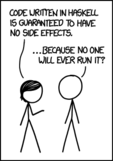

---
header-includes:
  \usetheme{Warsaw}
  \setbeamercolor{normal text}{fg=white,bg=black!90}
  \setbeamercolor{structure}{fg=white}
  \setbeamercolor{alerted text}{fg=red!85!black}
  \setbeamercolor{item projected}{use=item,fg=black,bg=item.fg!35}
  \setbeamercolor*{palette primary}{use=structure,fg=structure.fg}
  \setbeamercolor*{palette secondary}{use=structure,fg=structure.fg!95!black}
  \setbeamercolor*{palette tertiary}{use=structure,fg=structure.fg!90!black}
  \setbeamercolor*{palette quaternary}{use=structure,fg=structure.fg!95!black,bg=black!80}
  \setbeamercolor*{framesubtitle}{fg=white}
  \setbeamercolor*{block title}{parent=structure,bg=black!60}
  \setbeamercolor*{block body}{fg=black,bg=black!10}
  \setbeamercolor*{block title alerted}{parent=alerted text,bg=black!15}
  \setbeamercolor*{block title example}{parent=example text,bg=black!15}

author: Cameron Reuschel - Vincent Truchseß
title: Curry time - Learn you a Haskell
---
# Wat the haskell?

## Intro

###


###


### A pure functional Programming Language

  * Everything immutable
  * Everything is lazy
  * Everything is a function

## Getting started

### Tools

  * GHC - The Glasgow Haskell Compiler
  * A mature editor (e.g. vim)
  * REPL-Integration (e.g. vim-slime for vim users)

### Soak, Wash, Rinse, Repeat - The REPL

# Functions

## Basics

### Basic Syntax

```haskell
sum :: Num a => a -> a -> a
sum x y = x + y

-- type declarations can be omitted
times2 a = a `sum` a

abs :: (Num a, Ord a) => a -> a
abs x = if x < 0 then -x else x

compareTo :: (Num a, Ord a1) => a1 -> a1 -> a
compareTo x y 
  | x > y = 1
  | x < y = -1
  | otherwise = 0
```

## More on Functions

### Currying

* All functions take a single argument and return a single value

```haskell
sum :: Num a => a -> a -> a
sum x y = x + y

addTwo :: Num a => a -> a
addTwo = sum 2
```

* `sum` is a **curried** function: it takes a number `x` and returns a function that takes a number `y` and returns the sum of `x` and `y`

```haskell
-- (x +) :: a -> a
sum' :: Num a => a -> a -> a
sum' x = (x +)
```

### Higher order Functions & Lambdas

* A **higher order function** is a function that takes another function as an argument
* A **lambda** is an anonymous function with syntax \
  `\arg arg2 ... -> expression`

\bigskip

```haskell
flip :: (a -> b -> c) -> (b -> a -> c)
flip f = \x y -> f y x

negate :: (a -> Bool) -> (a -> Bool)
negate p = not . p
```

### Pattern matching

# Interlude: Brainfuck

## Brainfuck

### What is Brainfuck?

* Tape with cells holding a single byte each
* A pointer to a cell can be moved left and right
* The value of the cell can be incremented and decremented

| Comment | Description                                                 |
|:-------:|:------------------------------------------------------------|
|  `>`    | Move the pointer to the right                               |
|  `<`	  | Move the pointer to the left                                |
|  `+`	  | Increment the memory cell under the pointer                 |
|  `-`	  | Decrement the memory cell under the pointer                 |
|  `.`	  | Output the character signified by the cell at the pointer   |
|  `,`	  | Input a character and store it in the cell at the pointer   |
|  `[`	  | Jump past the matching `]` if the cell is 0                 |
|  `]`	  | Jump back to the matching `[` if the cell is nonzero        |

# Types

## Basic Types

### 

???

## Lists

### Creating Lists

```haskell
favoritePrimes :: [Int]
favoritePrimes = [3,7,9,11]

evenNumbers = [x | x <- [1..50], x `mod` 2 == 0]

evenNumbersAndOne = 1 : evenNumbers

alphabet = ['a'..'z'] ++ ['A' .. 'Z'
```

### Working on lists


### Data Types

???

## Type Classes

# Dealing with Side Effects

## Side Effects

### What is a Side Effect?

[columns]

[column=0.5]

*Any operation which modifies the state of the computer or which interacts with the outside world*

\bigskip

* variable assignment
* displaying something
* printing to console
* writing to disk
* accessing a database

[column=0.5]



[/columns]

### Dealing with Side Effects

* Haskell is **pure**: There are no side effects
* But every program interacts with its environment in some way
* The `IO` monad *describes* an interaction with the environment
* Descriptions can be *composed* through the *bind* operator `>>=`
* The `main` function in Haskell returns an `IO ()` which describes the sum of all side effects to be executed by the Haskell runtime

### Simulating imperative programming

```haskell
putStrLn :: String -> IO ()
getLine :: IO String
```

```haskell
getLine >>= (\firstLine -> 
  getLine >>= (\secondLine -> 
    putStrLine (firstLine ++ secondLine)
      >> putStrLine "Done."))
```

```haskell
do
  firstLine <- getLine 
  secondLine <- getLine
  putStrLine $ firstLine ++ secondLine
  putStrLine "Done."
```

### Example

`getLine` yields an `IO String` which describes how to *later* yield a string by executing controlled side effects:

\bigskip

```haskell
takeLinesUntil :: (String -> Bool) -> IO [String]
takeLinesUntil predicate = go predicate []
  where
    go predicate lines = do
      line <- getLine
      if predicate line
        then return $ reverse lines
        else go predicate $ line : lines
```

### Main method

```haskell
main :: IO ()
main = do
  args <- getArgs
  putStrLn "\nEnter code and input:\n"
  codeLines <- takeLinesUntil null
  let singleLineCode = intercalate "" codeLines
  let (code, input) = parseInput singleLineCode
  case validateBrackets code of
    TooManyOpen -> putStrLn tooManyOpenError
    TooManyClosed -> putStrLn tooManyClosedError
    NoCode -> putStrLn noCodeError
    Fine -> do
      let out = interpretCode code input
      putStrLn "Output:\n"
      putStrLn out
```

