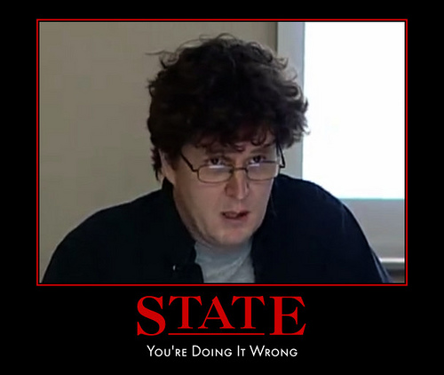
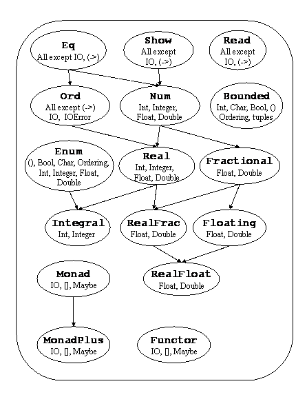

###


###


### A pure functional Programming Language

[columns]

[column=0.5]

{height=250px}

[column=0.5]

* Everything is immutable
* Everything is lazy
* Everything is a function
* Everything is awesome

[/columns]

## Getting started

### Tools

  * GHC - The Glasgow Haskell Compiler
  * A mature editor (e.g. vim, nvim, emacs, ...)
  * REPL-Integration (e.g. vim-slime for vim users)

### Soak, Wash, Rinse, Repeat - The REPL


# Functional concepts

## Purity

### What is a Side Effect?

[columns]

[column=0.5]

*Any operation which modifies the state of the computer or which interacts with the outside world*

\bigskip

* variable assignment
* displaying something
* printing to console
* writing to disk
* accessing a database

[column=0.5]

{height=200px}

[/columns]

### Purity: No Side Effects

[columns]

[column=0.6]

* Haskell is **pure** - no side effects
\smallskip
* `=` is mathematical equality
\smallskip
* Purity leads to **referential transparency**: for every `x = expr` you can replace `x` with `expr` without changing semantics
\smallskip
* An expression `f x` is **pure** if it is referentially transparent for every referentially transparent `x`

[column=0.4]



[/columns]

## Referential Transparency

### Referential Transparency - Example

***Not*** referentially transparent: \
Successive calls to `count()` return different values.

\smallskip

```c
int counter = 0;
int count() { return ++counter; }

int x = count();

int a, b;
a = x; b = x; // a == b == 1
a = count(); b = count(); // a == 2, b == 3
```

**Pure functions do not modify any state. **\
**They always return the same result given the same input.**

## Lazyness

### Lazyness

... not today

### Lazyness

* Eager evaluation: expression is evaluated as soon as it is used
* Lazy evaluation: expression is only evaluated when it is needed

\smallskip

```java
int counter = 0;
private int count() { return ++counter; }
```

```java
int foo = Optional.of(1337).orElse(count()); 
// Eager: foo == 1337; counter == 1;
```

```java
int foo = Optional.of(1337).orElseGet(() -> count());
// Lazy: foo == 1337; counter == 0;
```

**Everything in Haskell is evaluated lazily.**

# Functions

### Basic Syntax

```haskell
sum :: Num a => a -> a -> a
sum x y = x + y
```
```haskell
-- type declarations can be omitted
times2 a = a `sum` a
```
```haskell
abs :: (Num a, Ord a) => a -> a
abs x = if x < 0 then -x else x
```
```haskell
compareTo :: (Num a, Ord a1) => a1 -> a1 -> a
compareTo x y 
  | x > y = 1
  | x < y = -1
  | otherwise = 0
```

### Currying

[columns]

[column=0.6]

All functions take a single argument \
and return a single value

\bigskip

```haskell
sum :: Num a => a -> a -> a
sum x y = x + y
```

```haskell
addTwo :: Num a => a -> a
addTwo = sum 2
```

\bigskip

`sum` is a **curried** function: it takes an `x` and returns a function that takes a `y` that returns the sum of `x` and `y`

\bigskip

```haskell
-- (x +) :: a -> a
sum' :: Num a => a -> a -> a
sum' x = (x +)
```

[column=0.4]


[/columns]

### Higher order Functions & Lambdas

* A **higher order function** is a function that takes another function as an argument
* A **lambda expression** is an anonymous closure with syntax  
  `\arg arg2 ... -> expression`

\bigskip

```haskell
flip :: (a -> b -> c) -> (b -> a -> c)
flip f = \x y -> f y x
```
```haskell
negate :: (a -> Bool) -> (a -> Bool)
negate p = not . p
```

# Working with Types

### Basic Types

Besides the usual Number types (Integers, Floats, Fractions, ...) Haskell
also includes:
```hs
Chars:   'a', 'b', 'c', ...
Strings: "hello" = ['h', 'e', 'l', 'l', 'o']
Tuples:  (1, "hello", (\a -> a * 42))

```

## Lists

### Creating Lists

```haskell
favoritePrimes :: [Int]
favoritePrimes = [3,7,9,11]

evenNumbers = [x | x <- [0..50], x `mod` 2 == 0]
evenNumbers' = [0,2..50]
evenNumbersAndOne = 1 : evenNumbers

alphabet = ['a'..'z'] ++ ['A' .. 'Z']
```

### Basic list functions

```haskell
head [1, 2, 3]            -- > 1
tail [1, 2, 3]            -- > [2, 3]
init [1, 2, 3]            -- > [1, 2]
last [1, 2, 3]            -- > 3

take 2 [1, 2, 3]          -- > [1, 2]
takeWhile (< 3) [1, 2, 3] -- > [1, 2]

drop 2 [1, 2, 3]          -- > [3]
dropWhile (< 3) [1, 2, 3] -- > [3]
```

### More on Lists

```haskell
zip ['a', 'b'] [1..]            -- > [('a',1), ('b', 2)]
zipWith (+) [1, 2, 3] [4, 5, 6] -- > [5, 7, 9]

map abs [-1, -2, 3]             -- > [1, 2, 3]
filter even [1, 2, 3, 4]        -- > [2, 4]
any even [3, 5, 7]              -- > False

cycle [1, 2, 3] -- > [1, 2, 3, 1, 2, 3, ...]
repeat 'g'      -- > "ggggggggggggggggggg..."
```
Due to lazy evaluation we can have infinite lists.  
Don't run `length` on this. It takes forever.

### Folds - Formally known as Reducers

`foldl` accumulates a *sequence* into a value *left to right*
```haskell
foldl :: Foldable t => (b -> a -> b) -> b -> t a -> b
foldl (+) 0 [1..5]
```
```hs
foldl (+)     (0 + 1)                     [2..5]
foldl (+)    ((0 + 1) + 2)                [3..5]
foldl (+)   (((0 + 1) + 2) + 3)           [4, 5]
foldl (+)  ((((0 + 1) + 2) + 3) + 4)      [5]
foldl (+) (((((0 + 1) + 2) + 3) + 4) + 5) []
```

### Folds - Formally known as Reducers

`foldr` accumulates a *sequence* into a value *right to left*
```haskell
foldr :: Foldable t => (b -> b -> a) -> b -> t a -> b
foldr (+) 0 [1..5]
```
```hs
(1 +                     (foldr (+) 0 [2..5]))
(1 + (2 +                (foldr (+) 0 [3..5])))
(1 + (2 + (3 +           (foldr (+) 0 [4, 5]))))
(1 + (2 + (3 + (4 +      (foldr (+) 0 [5]   )))))
(1 + (2 + (3 + (4 + (5 + (foldr (+) 0 []    ))))))
```

## Custom Data Types

### Sum Types

Sum types are essentially represented as `enum`s in C-like languages

\smallskip

```haskell
data BracketValidationResult
  = TooManyOpen
  | TooManyClosed
  | Fine
  | NoCode
```

### Product Types

Product types are essentially `struct`s in C

\smallskip

```haskell
data Tape = Tape [Int] Int [Int] 
tape = Tape [1, 2] 3 [4]
left  (Tape l _ _) = l
right (Tape _ _ r) = r
curr  (Tape _ c _) = c
```
```haskell
-- record syntax
data Tape = Tape
  { left :: [Int], curr :: Int, right :: [Int] } 
tape  = Tape [1, 2] 3 [4]
tape' = Tape {left = [1, 2], curr = 3, right = [4]}
```

### Mix and Match

```haskell
data Point = Point Float Float
```

\bigskip

```haskell
data Shape
  = Circle { center :: Point
           , radius :: Float }
  | Rectangle { upperLeft :: Point
              , lowerRight :: Point }
```

## Type Classes

### Type Clases 1

Type classes are used to 'implement' an interface for a type

\smallskip

```haskell
class Eq a where
    (==), (/=) :: a -> a -> Bool
    x /= y = not (x == y)
    x == y = not (x /= y)
```

Implementing `Eq` for a type `T` makes the type magically work for every function that expects an instance of `Eq`

\smallskip

```haskell
instance Eq Tape where
  x == y = 
    left x == left y 
    && curr x == curr y 
    && right x == right y
```

### Type Classes 2

Type class instances can be derived from a type:

```haskell
data Tape = Tape [Int] Int [Int] deriving (Eq, Show)
```

Type classes itself can derive from other type classes:

```haskell
class (Eq a) => Num a where ...
```

Builtin useful type classes:

```
Eq, Show, Read, Ord, Bounded, Enum
Num, Integral, Real, Fractional
Foldable, Functor, Monad
```

### Overview - Type Class Hierarchy

{height=250px}

## Pattern matching

### Pattern matching: Simple case

```haskell
fib 1 = 1
fib 2 = 1
fib n = fib (n-1) + fib (n-2)
```

```haskell
fib n = case n of 
  1 -> 1
  2 -> 1
  n -> fib (n-1) + fib (n-2)
```

### Pattern Matching: Deconstruction

```haskell
quicksort [] = []
quicksort (p:xs) = (quicksort lesser) 
    ++ [p] 
    ++ (quicksort greater)
    where (lesser, greater) = partition (< p) xs

partition :: (a -> Bool) -> [a] -> ([a], [a])
```

### Pattern Matching: Deconstruction

```haskell
-- without overflow management
increment :: Tape -> Tape
```

```haskell
data Tape = Tape [Int] Int [Int]
increment (Tape left curr right) = 
    Tape left (curr + 1) right
```

```haskell
data Tape =
  Tape { left :: [Int], curr :: Int, right :: [Int] }
increment Tape
  { left = l
  , curr = c
  , right = r
  } = Tape l (c + 1) r
```

# Examples

### An Example - FizzBuzz

```haskell
fizzBuzz = zipWith stringify [1..] fizzBuzzes
  where
    stringify num "" = show num
    stringify _ str = str
    -- > stringify [(1, ""), (2, ""), (3, "Fizz")]
    -- > ["1", "2", "Fizz"]
    fizzBuzzes = zipWith (++) fizzes buzzes
    -- > ["", "", "Fizz", "", "Buzz", "Fizz",...]
    fizzes = cycle ["", "", "Fizz"]
    buzzes = cycle ["", "", "", "", "Buzz"]

["1","2","Fizz","4","Buzz","Fizz","7","8","Fizz"...]
```

### Another Example - The Fibonnacci Sequence

A naive implementation
```hs
fib 0 = 1
fib 1 = 1
fib n = fib (n - 1) + fib (n - 2)
```
A less naive implementation
```hs
fib = 1:1:(zipWith (+) fib (tail fib))

1:1:(      zipWith (+) 1:1:[...] 1:[...])
1:1:2:(    zipWith (+) 1:2:[...] 2:[...])
1:1:2:3:(  zipWith (+) 2:3:[...] 3:[...])
1:1:2:3:5:(zipWith (+) 3:5:[...] 5:[...])
```

### Another Example - Prime Numbers

An impementation of the ***Sieve of Eratosthenes***

```haskell
sieve = go 1 (False:(repeat True))
  where
    go i (True:xs) = True:(go (i + 1) newSieve)
      where 
        newSieve = zipWith (&&) xs (cycle seq)
        seq = (take (i - 1) (repeat True)) ++ [False]
    go i (x:xs) = x:(go (i + 1) xs)

primes = map fst $ filter snd $ zip [1..] sieve
```

# Brainfuck

### What is Brainfuck?

* Tape with cells holding a single byte each
* A pointer to a cell can be moved left and right
* The value of the cell can be incremented and decremented

| Comment | Description                                                 |
|:-------:|:------------------------------------------------------------|
|  `>`    | Move the pointer to the right                               |
|  `<`	  | Move the pointer to the left                                |
|  `+`	  | Increment the memory cell under the pointer                 |
|  `-`	  | Decrement the memory cell under the pointer                 |
|  `.`	  | Output the character signified by the cell at the pointer   |
|  `,`	  | Input a character and store it in the cell at the pointer   |
|  `[`	  | Jump past the matching `]` if the cell is 0                 |
|  `]`	  | Jump back to the matching `[` if the cell is nonzero        |

### The Idea

* Build an interpreter for Brainfuck in Haskell
* Very stateful but small problem
* Code and input through `stdin` separated by `!`

\bigskip

Find the whole program including tests at \
https://github.com/XDracam/brainfuck-haskell


## Getting started

### Defining the Tape

```haskell
data Tape = Tape
  { left :: [Int]
  , curr :: Int
  , right :: [Int]
  } deriving (Eq)

emptyTape :: Tape
emptyTape = Tape [] 0 []
```

### Printing the Tape

```haskell
import Data.List (intercalate, intersperse)

instance Show Tape where
  show (Tape l c r) =
    show $ "[" ++ l'
        ++ "|>>" ++ show c ++ "<<|"
        ++ r' ++ "]"
    where
      l' = intersperse '|'
           $ intercalate ""
           $ show <$> reverse l
      r' = intersperse '|'
           $ intercalate ""
           $ show <$> r
```

### Moving the tape

```haskell
moveLeft :: Tape -> Tape
moveLeft Tape [] rh r = Tape [] 0 (rh : r)
moveLeft Tape (c:l) rh r = Tape l c (rh : r)

moveRight :: Tape -> Tape
moveRight Tape l lh [] = Tape (lh : l) 0 []
moveRight Tape l lh (c:r) = Tape (lh : l) c r
```

### Incrementing and Decrementing

```haskell
increment :: Tape -> Tape
increment t = t {curr = (curr t + 1) `mod` 256}

decrement :: Tape -> Tape
decrement t = t {curr = (curr t - 1) `mod` 256}
```

### Reading and Writing

```haskell
readChar :: Tape -> Char
readChar Tape {curr = c} = chr c

writeChar :: Tape -> Char -> Tape
writeChar t c = t {curr = ord c}
```

\bigskip

Note: `writeChar` returns a function that yields a new tape after taking a char to write. The actual IO is performed in the *IO layer*.

## Dealing with Input

### Handle the Raw Input

```haskell
extractCode :: String -> String
extractCode = 
  filter (`elem` validChars) . takeWhile ('!' /=)
  where
    validChars = "<>[],.+-"

parseInput :: [String] -> (String, String)
parseInput codeLines = (extractCode code, tail input)
  where 
    codeWithLines = intercalate "\n" codeLines
    (code, input) = span (/= '!') codeWithLines
```

### Validate Brackets

```haskell
data ValidationResult
  = TooManyOpen | TooManyClosed | Fine | NoCode
  deriving (Eq, Show)

validateBrackets :: String -> ValidationResult
validateBrackets code
  | null code = NoCode
  | count > 0 = TooManyOpen
  | count < 0 = TooManyClosed
  | otherwise = Fine
  where
    count sum '[' = sum + 1
    count sum ']' = sum - 1
    count sum _ = sum
    count = foldl count 0 code
```

## Interpreting the Code

### Defining the Basics

```haskell
handleChar :: Char -> Tape -> Tape
handleChar '>' = moveRight
handleChar '<' = moveLeft
handleChar '+' = increment
handleChar '-' = decrement
handleChar other = error $ "Unexpected char: " ++ [other]

data InterpreterState = InterpreterState
  { code :: String
  , seen :: String
  , input :: String
  , output :: String
  , tape :: Tape
  }
```

### Running the code

```haskell
interpretCode :: String -> String -> (Tape, String)
interpretCode code input = 
  go (InterpreterState code "" input "" emptyTape)
  where
    go :: InterpreterState -> (Tape, String)
    go (InterpreterState "" _ _ out t) = (t, reverse out)
    go s@(InterpreterState (c:code) seen inp out t) = ...
```

### Handling Read and Write

```haskell
go s@(InterpreterState (c:code) seen inp out t) =
  case c of
    '.' -> go s { code = code, seen = '.' : seen
                , output = readChar t : out}
    ',' ->
      if null inp
        then error "Error: No input left."
        else go s {code = code, seen = seen'
                  , input = inp', tape = tape'}
      where ci:inp' = inp
            tape' = writeChar t ci
            seen' = ',' : seen
    -- LOOP HANDLING --
    c -> go s {code = code, seen = c : seen
              , tape = handleChar c t}
```

### Find Corresponding Brackets

```haskell
partitionByFinding :: Char -> String -> (String, String)
partitionByFinding c toView = go c toView "" 0
  where
    go :: Char -> String -> String -> Int -> (String, String)
    go c [] found _ =
      error $
      "Unexpected error: Failure to find a " ++
      [c] ++ " after finding " ++ found
    go c (h:toView) found 0
      | c == h = (c : found, toView)
    go c (h:toView) found open =
      case h of
        '[' -> go c toView ('[' : found) (open + 1)
        ']' -> go c toView (']' : found) (open - 1)
        other -> go c toView (other : found) open
```

### Handling Loops

```haskell
go s@(InterpreterState (c:code) seen inp out t) = 
-- READ/WRITE HANDLING --
'[' ->
  if curr t == 0 -- skip loop?
    then go s {code = todo, seen = loop ++ ('[' : seen)}
    else go s {code = code, seen = '[' : seen}
  where (loop, todo) = partitionByFinding ']' code
']' ->
  if curr t == 0 -- exit loop?
    then go s {code = code, seen = ']' : seen}
    else go s {code = loop ++ (']' : code), seen = rem}
  where (loop, rem) = partitionByFinding '[' seen
c -> go s {code = code, seen = c : seen
          , tape = handleChar c t}
```

## Dealing with IO and Side Effects

### Dealing with Side Effects

* Haskell is **pure**: There are no side effects
\bigskip
* But every program interacts with its environment in some way
\bigskip
* The `IO` monad *describes* an interaction with the environment
\bigskip
* Descriptions can be *composed* through the *bind* operator `>>=`
\bigskip
* The `main` function in Haskell returns an `IO ()` which describes the sum of all side effects to be executed by the Haskell runtime

### Simulating imperative programming

```haskell
putStrLn :: String -> IO ()
getLine :: IO String
```

```haskell
getLine >>= (\firstLine -> 
  getLine >>= (\secondLine -> 
    putStrLine (firstLine ++ secondLine)
      >> putStrLine "Done."))
```
\smallskip
**is equivalent to:**
\smallskip
```haskell
do
  firstLine <- getLine 
  secondLine <- getLine
  putStrLine $ firstLine ++ secondLine
  putStrLine "Done."
```

### IO - Example

`getLine` yields an `IO String` which describes how to *later* yield a string by executing controlled side effects:

\bigskip

```haskell
takeLinesUntil :: (String -> Bool) -> IO [String]
takeLinesUntil predicate = go predicate []
  where
    go predicate lines = do
      line <- getLine
      if predicate line
        then return $ reverse lines
        else go predicate $ line : lines
```

### 

```haskell
main :: IO ()
main = do
  args <- getArgs
  putStrLn "\nEnter code and input:\n"
  codeLines <- takeLinesUntil null
  let (code, input) = parseInput codeLines
  case validateBrackets code of
    TooManyOpen -> putStrLn tooManyOpenError
    TooManyClosed -> putStrLn tooManyClosedError
    NoCode -> putStrLn noCodeError
    Fine -> do
      let (out, _) = interpretCode code input
      putStrLn "Output:\n"
      putStrLn out
```

